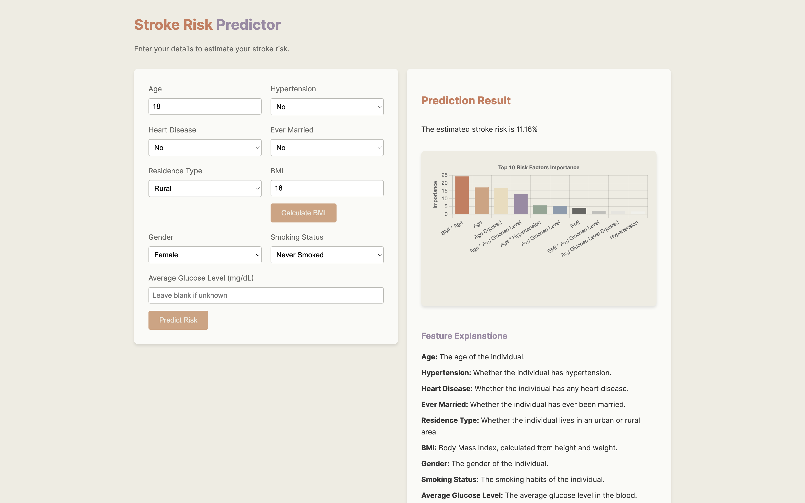

# Stroke Risk Predictor

## Project Overview
The Stroke Risk Predictor is a machine learning-based web application designed to assess an individual's risk of stroke based on various health and lifestyle factors. This tool aims to aid healthcare professionals and individuals in identifying potential stroke risks early, enabling timely intervention and preventive measures.

### Key Features
- **Comprehensive Analysis**: Analysis of a stroke prediction dataset.
- **Advanced Feature Engineering**: Creation of meaningful predictors.
- **Model Evaluation**: Comparison of multiple machine learning models (Logistic Regression, XGBoost, CatBoost).
- **Optimization**: Focused on high recall to minimize missed stroke cases.
- **User-Friendly Interface**: Web interface for easy risk assessment.

After rigorous testing and optimization, CatBoost was selected as the final model due to its superior performance in balancing recall and precision for this imbalanced dataset.

## Web Application
The project includes a Flask-based web application that provides an intuitive interface for users to input their health information and receive a stroke risk prediction. 



## Deployment
The Stroke Risk Predictor is deployed on Google Cloud Platform App Engine, ensuring high availability and scalability. You can access the live application [here](https://20240701t211219-dot-personal-projects-420518.uc.r.appspot.com/).

## Installation Guide
To set up this project locally, follow these steps:

1. **Clone the repository**:
    ```sh
    git clone https://github.com/vytautas-bunevicius/stroke-risk-predictor.git
    cd stroke-risk-predictor
    ```

2. **Create a virtual environment**:
    ```sh
    python -m venv venv
    ```

3. **Activate the virtual environment**:
    - On Windows:
      ```sh
      venv\Scripts\activate
      ```
    - On macOS and Linux:
      ```sh
      source venv/bin/activate
      ```

4. **Install the required dependencies**:
    ```sh
    pip install -r requirements.txt
    ```

5. **Run the Flask application**:
    ```sh
    python src/app.py
    ```

6. **Open a web browser and navigate to** `http://localhost:5000` **to view the application**.

## Running Tests
To run the test suite:
```sh
python -m pytest tests/
```

## Deployment to Google Cloud Platform
To deploy the application to Google Cloud Platform App Engine:

1. Ensure you have the Google Cloud SDK installed and configured.
2. Run the following command in the project root directory:
    ```sh
    gcloud app deploy
    ```

## Future Improvements
- Continuous model updates with new data.
- Expansion of the feature set to include more relevant health indicators.
